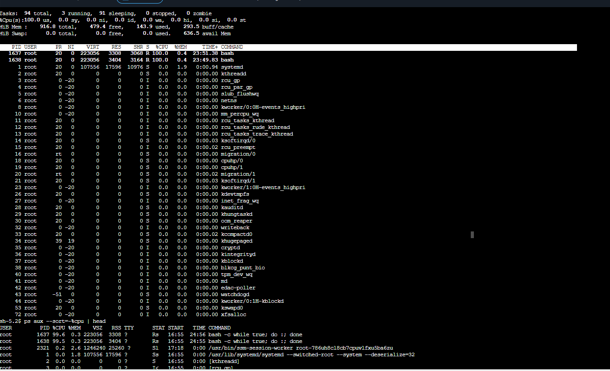
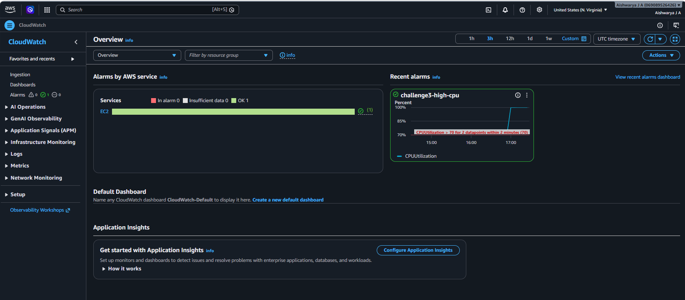

# Challenge 3 — Findings

## Root cause
The EC2 instance `challenge3-stress` became slow because two shell processes were continuously executing an infinite busy loop:

```bash
bash -c 'while true; do :; done'
```

These processes consumed nearly 100% of the available CPU, causing the `challenge3-high-cpu` CloudWatch alarm to trigger.

## Fix applied
I connected to the instance using AWS Systems Manager Session Manager and investigated the running processes using:

```bash
top
ps aux --sort=-%cpu | head
```

I identified the two runaway shell processes and terminated them:

```bash
sudo kill 1637 1638
```

After terminating the processes, CPU utilization dropped back to normal and the `challenge3-high-cpu` CloudWatch alarm returned to the **OK** state.

## Investigation Process
1. Deployed the `challenge-3` CloudFormation stack.
2. Observed CPU utilization reach nearly 100%.
3. Investigated the instance through Session Manager.
4. Used `top` and `ps` to identify the processes consuming CPU.
5. Terminated the infinite-loop processes.
6. Verified that CPU usage returned to normal.
7. Confirmed that the CloudWatch alarm recovered to the **OK** state.

## Evidence

### Screenshot 1 – High CPU Diagnosis


### Screenshot 2 – Alarm Recovery
